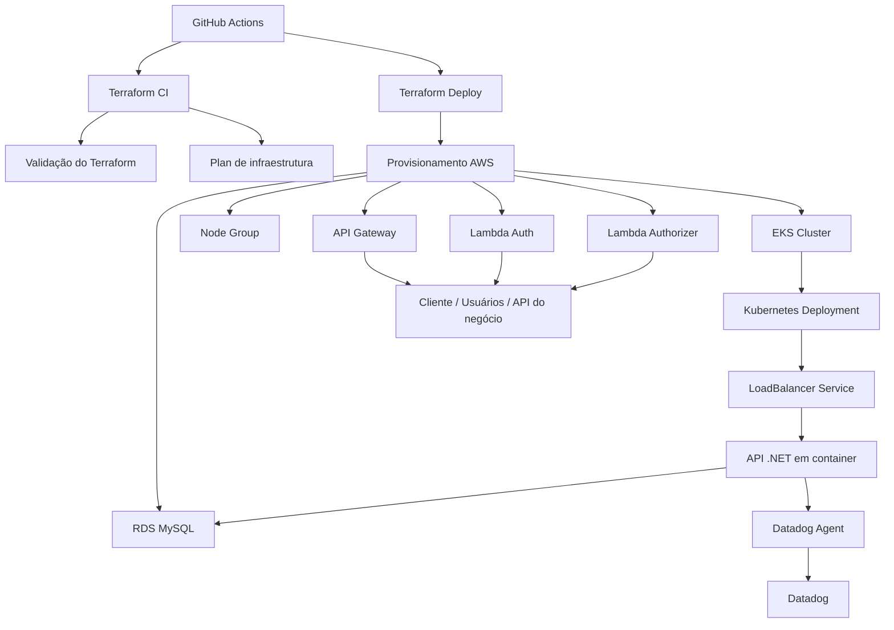

# Tech Challenge Infra Kubernetes

## Objetivo

Este repositório provisiona a infraestrutura necessária para executar a API da solução Auto Repara em um cluster Amazon EKS, com acesso via API Gateway, autenticação via Lambda, banco de dados RDS MySQL e monitoramento com Datadog.

O projeto foi estruturado para automatizar a criação e atualização do ambiente em AWS usando Terraform e GitHub Actions.

## Visão geral da arquitetura



## Tecnologias utilizadas

- Terraform
- AWS EKS
- Amazon RDS MySQL
- Amazon API Gateway
- AWS Lambda
- Kubernetes
- Helm
- Datadog
- GitHub Actions
- Docker / containers

## Estrutura do repositório

```text
techchallengeinfrakubernets/
├── .github/
│   └── workflows/
│       ├── terraform-ci.yml
│       └── terraform-deploy.yml
├── src/
│   ├── main.tf
│   ├── variables.tf
│   └── components.yaml
├── actions-runner/
├── .gitignore
└── README.md
```

## Pré-requisitos

Antes de executar ou fazer deploy deste ambiente, verifique se você possui:

- Conta AWS ativa com permissões para criar EKS, RDS, API Gateway, Lambda e IAM
- Terraform instalado
- AWS CLI configurado
- kubectl instalado
- Acesso ao cluster EKS (via `aws eks update-kubeconfig`)
- Secrets configurados no GitHub Actions:
  - `AWS_ACCESS_KEY_ID`
  - `AWS_SECRET_ACCESS_KEY`
  - `AWS_SESSION_TOKEN`
  - `AWS_REGION`
  - `TF_VAR_RDS_PASSWORD`
- Um runner self-hosted configurado com o label `eks-runner` para as pipelines do GitHub Actions

## Componentes principais

### EKS

- Cria o cluster EKS (`cluster-eks`)
- Define um node group com escalabilidade mínima e máxima
- Habilita a comunicação com o banco RDS e com os serviços da aplicação

### Banco de dados

- Utiliza um RDS MySQL já existente identificado por `techchallenge-mysql`
- O security group do RDS é ajustado para aceitar tráfego do cluster EKS

### Aplicação

- Faz deploy de um container da aplicação em um Deployment Kubernetes
- Expõe a API por meio de um `Service` do tipo `LoadBalancer`
- Configura `HorizontalPodAutoscaler` para escalonamento de pods
- Define variáveis de ambiente e secrets da aplicação

### API Gateway

- Cria um REST API com rotas para autenticação e endpoints da API principal
- Usa Lambda authorizer para proteger endpoints de negócio
- Redireciona requisições para os serviços internos do Kubernetes

### Observabilidade

- Instala o operador do Datadog via Helm
- Configura o Datadog Agent para monitorar o cluster EKS
- Habilita coleta de logs, APM e observabilidade de clusters

## Pipeline de CI/CD

### CI: Terraform validate

Arquivo: `.github/workflows/terraform-ci.yml`

A pipeline executa quando há:

- push em branches `feature/*`
- pull request para `main`

Etapas:

1. checkout do código
2. validação da branch de origem (feature/*)
3. instalação do Terraform
4. `terraform init -backend=false`
5. `terraform fmt -check -recursive`
6. `terraform validate`
7. criação automática de pull request para `main` quando o push estiver em feature

### Plan

A etapa de `plan`:

- configura credenciais AWS
- inicializa o Terraform com backend remoto
- executa `terraform plan -out=tfplan`

### Deploy

Arquivo: `.github/workflows/terraform-deploy.yml`

A pipeline é acionada por push na branch `main` e executa:

1. checkout do código
2. instalação do Terraform
3. configuração das credenciais AWS
4. `terraform init -reconfigure -input=false`
5. `terraform apply -input=false -auto-approve`

> A variável `TF_VAR_rds_password` é enviada por secret do GitHub para o apply.

## Como executar localmente

### 1) Clonar o repositório

```bash
git clone <url-do-repositorio>
cd techchallengeinfrakubernets
```

### 2) Configurar AWS

```bash
aws configure
aws sts get-caller-identity
```

### 3) Inicializar Terraform

```bash
cd src
terraform init -reconfigure -input=false
```

### 4) Validar a infraestrutura

```bash
terraform fmt -check -recursive
terraform validate
```

### 5) Gerar plano

```bash
terraform plan -input=false -out=tfplan
```

### 6) Aplicar infraestrutura

```bash
terraform apply -input=false -auto-approve
```

### 7) Verificar saídas

```bash
terraform output
```

Saídas esperadas:

- `api_url`
- `load_balancer_url`
- `eks_cluster_name`

## Acesso à aplicação e documentação

A aplicação é exposta através do API Gateway e também por um Load Balancer do Kubernetes.

### Swagger / OpenAPI

O Terraform configura um endpoint no API Gateway para expor a documentação Swagger da aplicação na rota raiz, acessível por:

```text
https://<api-id>.execute-api.<regiao>.amazonaws.com/prod/
```

Também é possível acessar diretamente a documentação da API a partir do load balancer, se a aplicação estiver rodando no EKS:

```text
http://<load-balancer-host>/swagger/index.html
```

### Postman

Para testar a API no Postman, use a URL base gerada pelo API Gateway:

```text
https://<api-id>.execute-api.<regiao>.amazonaws.com/prod
```

Se houver uma collection oficial do projeto, ela deve ser adicionada aqui no formato:

```text
https://www.postman.com/<workspace>/<collection>
```

## Observações importantes

- Os valores sensíveis devem sempre ficar em secrets, nunca em código versionado.
- O projeto usa um backend S3 para o state do Terraform.
- O cluster EKS e a aplicação dependem de permissões AWS previamente configuradas no ambiente do runner.
- O canal `prod` no API Gateway é a etapa final do deployment público da API.

## Boas práticas recomendadas

- Usar secret management para credenciais de banco e tokens
- Manter o Terraform em uma branch `feature/*` até merge em `main`
- Revisar sempre o plano antes de aplicar mudanças de infraestrutura
- Monitorar logs e métricas via Datadog após o deploy

## Referências rápidas

- Terraform: `src/main.tf`
- Variáveis: `src/variables.tf`
- Manifestos Kubernetes: `src/components.yaml`
- Pipeline CI: `.github/workflows/terraform-ci.yml`
- Pipeline Deploy: `.github/workflows/terraform-deploy.yml`
